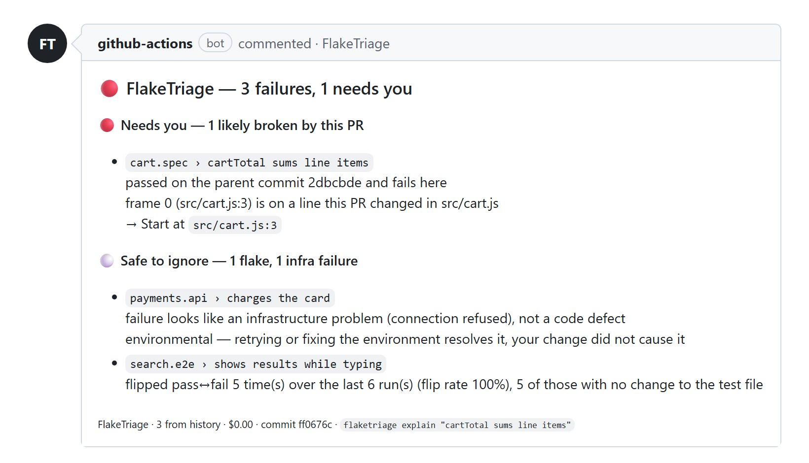

# FlakeTriage — Flaky Test Detection for GitHub Actions

[](https://github.com/AleksandrJelohhin/flaketriage/actions/workflows/ci.yml)
[](LICENSE)

**Is that red CI build a flaky test or a real regression?** FlakeTriage reads the
JUnit XML your test suite already produces, checks the failure against test history
and the pull request diff, and posts **one short, actionable verdict** on the PR:
*your change broke this*, *this test is flaky*, or *this is CI infrastructure noise*.

- 🔁 **Flaky test detection from history** — did this test flip pass/fail on
  unchanged code, or pass on retry within the same commit?
- 🎯 **Regression blame** — links the failing stack trace to the exact changed
  file and line in the PR diff.
- 🧬 **Failure fingerprinting** — normalizes messages and stack traces so the same
  failure is recognized across runs, branches, and machines.
- 🌐 **Infra-failure detection** — DNS errors, connection refused, pool exhaustion,
  runner timeouts: flagged as environment, not your code.
- 🤖 **LLM only as a last resort** — only genuinely ambiguous failures are sent to
  a model (Claude, Gemini, OpenAI, or a local LLM), redacted, in one batched call.
  Works fully offline with `--no-llm`.

<p align="center">
  
</p>

## Contents

- [Quick start: GitHub Action](#quick-start-github-action)
- [Quick start: CLI](#quick-start-cli)
- [What the PR comment looks like](#what-the-pr-comment-looks-like)
- [How it works](#how-it-works)
- [Supported test frameworks](#supported-test-frameworks)
- [LLM providers (optional)](#llm-providers-optional)
- [Privacy and data boundary](#privacy-and-data-boundary)
- [FAQ](#faq)
- [Documentation](#documentation) · [License](#license)

## Quick start: GitHub Action

```yaml
# .github/workflows/flaketriage.yml
name: FlakeTriage
on: pull_request

permissions:
  contents: read
  pull-requests: write   # post the sticky PR comment
  actions: write         # persist test history in actions/cache

jobs:
  test:
    runs-on: ubuntu-latest
    steps:
      - uses: actions/checkout@v4
        with:
          fetch-depth: 0              # FlakeTriage diffs base..head for blame

      - run: npm test || true         # your tests, writing JUnit XML; keep going on failure

      - uses: AleksandrJelohhin/flaketriage@v1
        with:
          reports: "**/junit*.xml"
          fail-on: regression         # only real regressions turn the build red
          anthropic-api-key: ${{ secrets.ANTHROPIC_API_KEY }}   # optional
```

The action doesn't run your tests. It triages the reports they leave behind, keeps
**one sticky comment** per PR (edited in place on every push), and writes a fuller
drill-down report to the job summary. All inputs and outputs:
[action/README.md](action/README.md).

## Quick start: CLI

```bash
git clone https://github.com/AleksandrJelohhin/flaketriage && cd flaketriage
npm install && npm run build

# triage the JUnit reports for the current commit of your repo
node dist/cli.js run --repo ../my-app --reports 'build/test-results/**/*.xml'

node dist/cli.js explain 'applies discount code'   # show every input behind a verdict
node dist/cli.js stats --min-runs 5                # flakiest tests by flip rate
node dist/cli.js history 'applies discount code'   # pass/fail timeline for one test
node dist/cli.js backfill --repo owner/name --days 90 --token "$(gh auth token)"
```

`backfill` imports past GitHub Actions runs, so a first install already knows
which tests are flaky. Output formats: `--format text | md | summary | json`.

## What the PR comment looks like

Real output from a PR that renamed `cart.items` to `cart.lines`, triaged with
Gemini. The infra failure was classified deterministically; the two ambiguous
failures went to the model:

```text
🔴 FlakeTriage — 1 passed, 3 failed/error, 0 skipped
   2 need you

🔴 Needs you
  • cart.spec › cartTotal sums line items [high] — likely broken by this PR (model)
      src/cart.js replaced cart.items iteration with cart.lines and changed the return type to an object.
      → Restore support for cart.items or update cart.spec.js to match the new cart.lines data contract.
  • checkout.e2e › user can place an order [medium] — likely broken by this PR (model)
      Breaking changes in src/cart.js prevent the checkout page from calculating cart totals.
      → Fix cartTotal in src/cart.js to return the expected total format and re-run the e2e suite.

⚪ Safe to ignore
  • payments.api › charges the card [high] — infrastructure, not your change
      failure looks like an infrastructure problem (connection refused), not a code defect

   1 from history, 2 from model · $0.00 · gemini-3.6-flash
```

Failures are grouped by **what you should do** — 🔴 *Needs you*, 🟠 *Look when you
can*, ⚪ *Safe to ignore* — not by taxonomy.

## How it works

Most of the signal is deterministic. The LLM is the last step, not the first.

1. **Ingest** — parse JUnit / xUnit XML (nested suites, Surefire rerun markers,
   CDATA, malformed real-world files) or a Playwright JSON report.
2. **Normalize and fingerprint** — strip timestamps, UUIDs, ports, temp paths and
   vendor stack frames, then hash. Same fingerprint means the same failure.
3. **History** — every run goes into a local SQLite timeline (persisted between CI
   runs via `actions/cache`), used to compute flip rates and retry outcomes.
4. **Blame** — correlate stack frames with the PR diff: exact line, same hunk, same
   file, or a file that imports a changed file.
5. **Classify** — a decision tree, first match wins:

   | Verdict | Meaning |
   |---|---|
   | `flake_confirmed` | Failed, then passed on retry: in the same run's report, or in another CI attempt of the same commit |
   | `infra_failure` | Matches a known infrastructure signature |
   | `always_failing` | Already failing before this change |
   | `flake_likely` | Flips pass/fail on unchanged code |
   | `real_regression` | Green on the parent commit **and** blamed on the diff |
   | `ambiguous` | Not enough signal, so it goes to the LLM (if enabled) |

Every verdict carries human-checkable evidence. `flaketriage explain <test>` shows
the timeline, fingerprint matches, and blame links behind it.

## Supported test frameworks

Anything that writes JUnit-style XML. The parser is tested against **303 real
failing reports from 212 public repositories**, including:

Java (Maven Surefire, Gradle, TestNG) · Python (pytest) · JavaScript/TypeScript
(Jest, Vitest, Playwright, Cypress, Mocha) · PHP (PHPUnit) · Ruby (RSpec) ·
Go (gotestsum) · k6 load tests · CTest and other xUnit emitters.

**Playwright with retries:** point `reports` at Playwright's JSON report
(`reporter: [["json", { outputFile: "playwright-report.json" }]]`) instead of its
JUnit file. Playwright's JUnit reporter writes a test that failed and then passed
on retry as a plain pass, so those flakes only show up in the JSON report. Both
formats give the same test keys, so history carries over. Don't pass both files
for the same run, or every test is counted twice.

## LLM providers (optional)

| `--provider` | Key / config | Default model |
|---|---|---|
| `anthropic` | `ANTHROPIC_API_KEY` | `claude-opus-5` |
| `bedrock` / `vertex` / `foundry` | AWS / GCP / Azure credentials | `claude-opus-5` |
| `gemini` | `GEMINI_API_KEY` or `GOOGLE_API_KEY` | `gemini-3.6-flash` |
| `openai` | `OPENAI_API_KEY` | `gpt-4o-mini` |
| `local` / `openai-compatible` | `--llm-base-url` (Ollama, LM Studio, vLLM, llama.cpp) | `qwen2.5` |
| `custom` | `--llm-base-url` (Anthropic-compatible proxy) | `claude-opus-5` |
| `none` / `--no-llm` | — | no network calls |

`--provider auto` (the default) picks Anthropic, then Gemini, then OpenAI, based on
which key is set. Otherwise it skips escalation. In the GitHub Action, pass
`anthropic-api-key`, or set `GEMINI_API_KEY` / `OPENAI_API_KEY` in the step's
`env:`. Settings can also live in `.flaketriage.yml`:

```yaml
llm:
  provider: gemini
  model: gemini-3.6-flash
redact:
  patterns:
    - "internal-[a-z]+-token"
```

## Privacy and data boundary

- **Only ambiguous failures** leave your CI, at most 15 per run, with truncated
  stacks and diff.
- **Secrets are redacted** from the real outbound request: Bearer tokens,
  `password=` / `token=` assignments, AWS keys, PEM private keys, and
  `sk-`, `ghp_`, `AIza`, `xox` API keys, plus your own patterns.
- **`--print-payload`** prints the exact redacted request and exits without
  opening a socket, so you can audit what would be sent.
- **`--no-llm`** never touches the network. Tests check both guarantees by
  asserting that `fetch` is never called.

## FAQ

**How is this different from retrying flaky tests?**
Retries hide flakes. FlakeTriage records them and tells flaky tests apart from real
regressions, so a retry that turns green is evidence rather than silence.

**Do I need an LLM or an API key?**
No. History, fingerprinting, blame and infra signatures handle most failures on
their own. The model only sees what those can't decide.

**Does it work outside GitHub Actions?**
The CLI is CI-agnostic: it only needs JUnit XML and a git checkout, so it runs in
any CI system. A native integration ships for GitHub Actions.

**Where is the test history stored?**
In a local SQLite file. In the GitHub Action it is persisted with `actions/cache`,
which evicts entries after 7 days and is branch-scoped. See
[action/README.md](action/README.md) for the trade-offs.

## Documentation

- [action/README.md](action/README.md) — GitHub Action inputs, outputs, history caching
- [test/fixtures/real/README.md](test/fixtures/real/README.md) — the real-world test corpus
- [CONTRIBUTING.md](CONTRIBUTING.md) — dev setup, where things live, good first issues

### Develop

```bash
npm install
npm run build        # tsc → dist/
npm test             # vitest
npm run typecheck
```

TypeScript (strict), Node 20+, ESM. Pure functions in `src/core/`: no I/O, no
clock, no randomness.

## License

Source-available under the [Business Source License 1.1](LICENSE). You can run
FlakeTriage, CLI or GitHub Action, in your own CI for free, including commercially.
You need a commercial license to redistribute it or offer it as a hosted service.
It converts to Apache-2.0 on 2030-09-11. For commercial licensing,
[open an issue](https://github.com/AleksandrJelohhin/flaketriage/issues).
